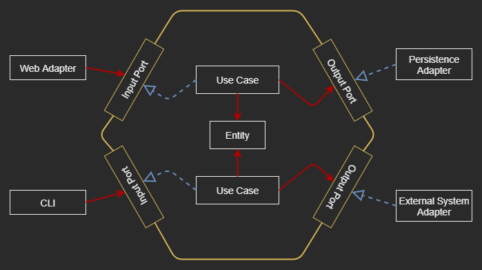

# The Lab of Hexagonal-Architecture

|  |
| --- |

## [Why Care About Architecture?](notes/01_Why_Care_About_Atchitecture.md)

## [The Goal of This Project](notes/02_The_Goal_Of_This_Lab.md)

## [What's Wrong with Layers? ](notes/03_What_is_Wrong_with_Layers.md)

## [The Overview of Hexagonal Architecture](notes/04_The_Overview_of_Hexagonal_Architecture.md)

## [Organizing Code](notes/05_Organizing_Code.md)

----

## Resources
### [MD Cheatsheet](https://github.com/tchapi/markdown-cheatsheet/blob/master/README.md)