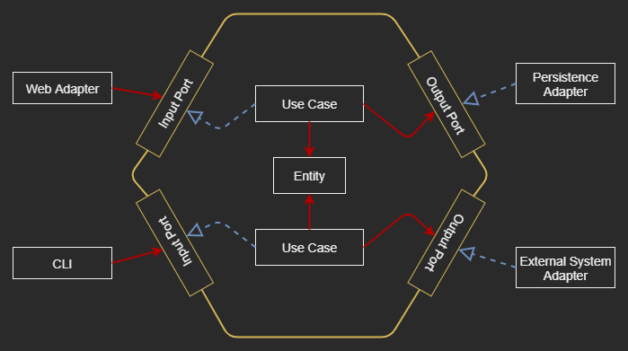

# The Lab of Hexagonal-Architecture

|  |
| --- |

## [Why Care About Architecture?](doc/notes/01_Why_Care_About_Atchitecture.md)

## [The Goal of This Project](doc/notes/02_The_Goal_Of_This_Lab.md)

## [What's Wrong with Layers? ](doc/notes/03_What_is_Wrong_with_Layers.md)

## [The Overview of Hexagonal Architecture](doc/notes/04_The_Overview_of_Hexagonal_Architecture.md)

## [Organizing Code](doc/notes/05_Organizing_Code.md)

## [Implementing a Use Case](doc/notes/06_Implementing_a_Use_Case.md)

## [Implementing a Web Adapter](doc/notes/7_Implementing_a_Web_Adapter.md)

## [Implementing a Persistence Adapter](doc/notes/8_Implementing_a_Persistence_Adapter.md)

## [Testing Architecture Elements](doc/notes/9_Testing_Architecture_Elements.md)

## [Mapping Between Boundaries](doc/notes/10_Mapping_Between_Boundaries.md)

## [Assembling the Application](doc/notes/11_Assembling_the_Application.md)

## [Enforcing Architecture Boundaries](doc/notes/12_Enforcing_Architecture_Boundaries.md)

## [Deciding on an Architecture Style](doc/notes/14_Deciding_on_an_Architecture_Style.md)

----

## Resources
- ### [MD Cheatsheet](https://github.com/tchapi/markdown-cheatsheet/blob/master/README.md)
- ### [Introduction to ArchUnit](https://www.baeldung.com/java-archunit-intro)
- ### [ArchUnit User Guide](https://www.archunit.org/userguide/html/000_Index.html)
- ### [ArchUnit API](https://javadoc.io/doc/com.tngtech.archunit/archunit/latest/index.html)
- ### [ArchUnit Maven plugin](https://github.com/societe-generale/arch-unit-maven-plugin)
- ### [ArchUnit-Examples](https://github.com/TNG/ArchUnit-Examples)