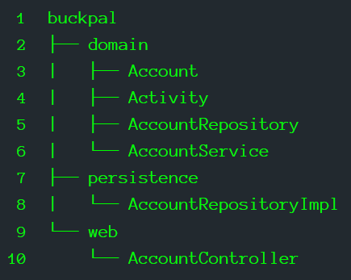
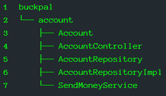
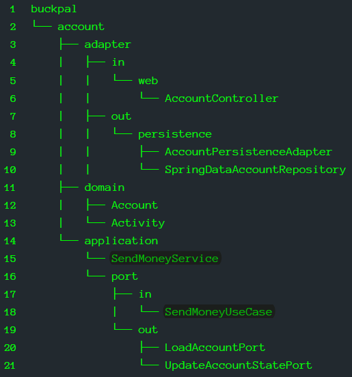
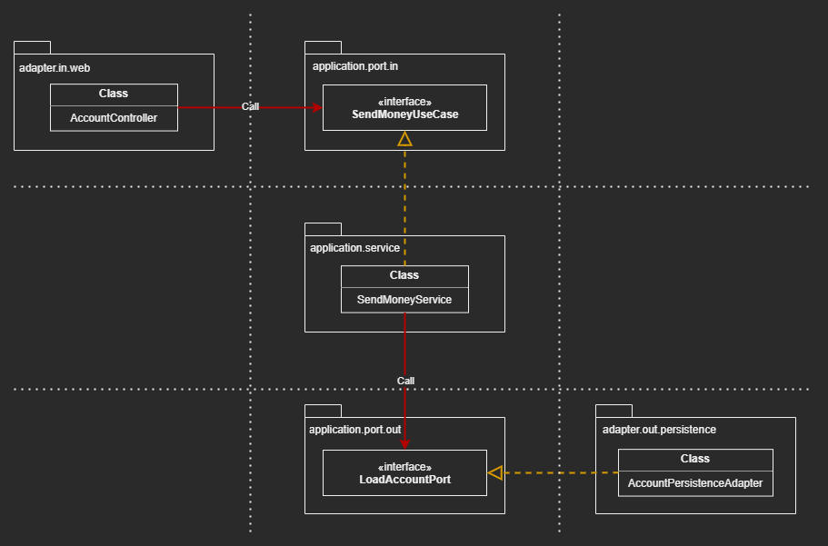

# Organizing Code

## Overview

- At the first, we set up a nice-looking structure of packages that we intend to
  use for the rest of project

- Later, the package structure becomes a nice-looking facade for an unstructured 
  mess of code
    - Classes in one package import classes from other packages that should not 
      be imported 

### The Application
- the BuckPal application

### The User Case
- Sending Money: a user can transfer money from his account to another


## Organizing By Layer

### ___A Suboptimal Package Structure___

|  |
| --- |

#### 1. No package boundary between Functional Slices or Features 

#### 2. Can’t see which use cases the application provides

#### 3. Can’t see the Hexagonal Architecture within the Package Structure
- Can’t see which functionality called by the web adapter
- Can't see which functionality the persistence adapter provides for the domain 


## Organizing By Feature

|  |
| --- |

### What Improved? 

- All the code related to ``` Account ``` moved into the high-level package 
  account

- Layer Packages were removed

- Each new group of features will get a new high-level package next to 
  ```account ```

- Enforce package boundaries between the features by using package-private 
  visibility for the classes

- The Package Boundaries + Package-Private Visibility make unwanted dependencies 
  between features not possible

- Made the app’s functionality visible in the code 
    - Narrow ``` Services ``` responsibility by renaming ``` AccountService ``` 
      to ``` SendMoneyService ```

### Still Have Defects

- The new architecture is even less visible than the package-by-layer approach 
    - No package names identifying adapters
    - No package names identifying ports
    - Repository implementation stay with Account Entity in the same package

- Can't know which part of the code is responsible for which part of in the 
  architecture diagram

  
## An Architecturally Expressive Package Structure

- Incoming/Outgoing Ports and Incoming/Outgoing Adapters are main architecture 
  elements 

|  |
| --- |

|  |
| --- |

### What Improved?

- There is no "architecture/code gap" or "model/code gap" any more
  
- Each element of the architecture can directly be mapped to one of the packages

- Each Use Case has its own module, like ``` account ```

- Have the domain package containing our domain model

- The ``` application ``` package contains a service layer around this domain 
  model 
    - ``` SendMoneyService ``` implements the incoming port interface 
      ``` SendMoneyUseCase ```
    - ``` SendMoneyService ``` also uses the outgoing port interfaces 
      ``` LoadAccountPort ``` and ``` UpdateAccountStatePort```, which are 
      implemented by the persistence adapter

- The ``` adapter ``` package contains 
    - The incoming adapters calling th incoming Ports
    - The outgoing adapters providing implementations for the outgoing Ports


### Rather Helpful instead of Confusing

- It's so easy to map the corresponding part in the architecture to the code
  
- Filled the "Architecture/Code Gap", and the "Model/Code Gap"

> The architecture must not be an abstract concept that cannot be directly 
> mapped to the code

> The package structure (among other things) must reflect the architecture


### Access Packages

- Adapter Packages
    - All classes should be package private and not exposed
    - All classes are called over Ports other than the outside world
    - No accidental dependencies from the Services (application layer) to the 
      Adapters
    - It's very easy to replace one adapter with another implementation

- Port Package (API Package)
    - All classes should be public and exposed

- Domain Package
    - All classes must be public to be accessible by services, potentially by 
      Adaptors

- Service (application) Package 
    - All classes should be package private and not exposed
    - All classes must be hidden behind the incoming port interfaces


### Directly Map to DDD (Another Appealing Advantage / AAA)

- This expressive package structure directly maps to DDD concepts 
    - The high-level package, account is a bounded context 
        - Has dedicated entry and exit points (the ports) to communicate with 
          other bounded contexts

- Within the domain package
    - Devs can build any domain model they want 
    - Devs can use all the tools DDD provides


### Still Take Discipline to Maintain Over the Lifetime

- There is no perfection 
- At least, this package structure reduced the gap between code and architecture


## The Role of Dependency Injection

|  |
| --- |

> The essential requirement of such a clean architecture is that the application 
> layer should not have dependencies to the incoming and outgoing adapters

- DI gives ``` adapter.in.web.AccountController``` an Instance of ``` application.port.in.SendMoneyUseCase ```


- DI gives ``` application.service.SendMoneyService ``` an Instance of ``` application.port.out.LoadAccountPort ```


## Summary

### By creating an expressive package structure with Hexagonal Architecture

- We make the actual code structure as close to the target architecture as possible
  

- Finding an element of the architecture in the code is now a matter of 
  navigating down the package structure along the names of certain boxes in an 
  architecture diagram


- All above, helping in 
    - Communication
    - Development 
    - Maintenance
