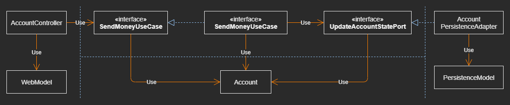
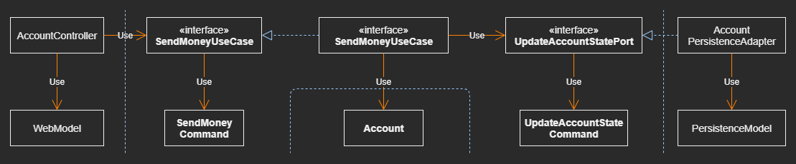
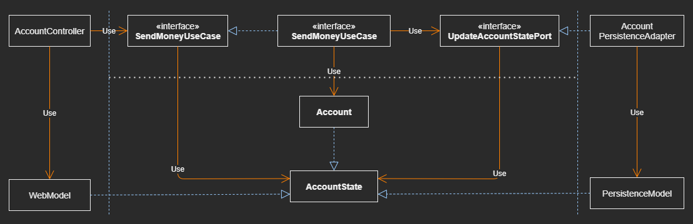

# Mapping Between Boundaries

## The “No Mapping” Strategy

### All layers use the same model, no mapping between layers

### The Consequences

- For web layer which exposing its model via REST, annotations for serializing 
  fields into JSON 

- For using ORM framework, annotations defining the database mapping

- Both of above violate the Single Responsibility Principle since the Account 
  class has to be changed for reasons of the Web, Application, and Persistence 
  layer 

- Domain model in application layers isn't interested in both of above

- Each layer might require certain custom fields on the Account class
    - Leads to a fragmented domain model with certain fields only relevant in 
      one layer 
      
### “No Mapping” strategy is a perfectly valid option
- as long as all layers need exactly the same information in exactly the same 
  structure 

### Use Cases Start their life as simple CRUD use cases

### Later, might grow into a full-fledged business use case 
- with a rich behavior and validations which justify (合法化) a more expensive 
  mapping  strategy 


## The “Two-Way” Mapping Strategy

|  |
| --- |

### The Web Layer maps the Web Model into the Input Model 
- which is expected by the Incoming Ports 

### The Web Layer maps domain objects back into the Web Model

### Each layer can modify its own model without affecting the other layers

### Domain Model not dirtied by Web or Persistence Concerns
- It does not contain JSON or ORM mapping annotations 
- The Single Responsibility Principle is satisfied

### Drawbacks
- Boilerplate Code
- Takes up a good portion of time
- Debugging mapping logic is a pain


## The “Full” Mapping Strategy
|  |
| --- |

### A separate input and output model per operation
- Instead of using the domain model to communicate across layer boundaries
- Uses ``` SendMoneyCommand ``` as an Input Model to the ``` SendMoneyUseCase ``` 
  port

``` 
@Value
@EqualsAndHashCode(callSuper = false)
public class SendMoneyCommand extends SelfValidating<SendMoneyCommand> {

    @NotNull
    private final Account.AccountId sourceAccountId;

    @NotNull
    private final Account.AccountId targetAccountId;

    @NotNull
    private final Money money;

    public SendMoneyCommand(Account.AccountId sourceAccountId,
                            Account.AccountId targetAccountId,
                            Money money) {

        this.sourceAccountId = sourceAccountId;
        this.targetAccountId = targetAccountId;
        this.money = money;

        this.validateSelf();
    }

}///:~
```

> ___command (of something)___: 
> - Your knowledge of something 
> - Your ability to do or use something, (especially a language)

### The Web-Layer maps its input into the  ``` Command ``` object of the App-Layer

### Each Use Case has its own ``` Command ``` with its own fields and validations

### The App-Layer maps the ``` Command ``` object into whatever it needs 
- to modify the domain model according to the use case

### Mapping from the one layer into many different commands
- Requires even more mapping code
- Being significantly easier to implement and maintain
    - Hasn't to handle the needs of many use cases instead of only one

### Not a Global Pattern
- Plays out its advantages best between the Web-Layer (or any other incoming 
  adapter) and the App-Layer to clearly demarcate the state-modifying use cases 
  of the application
- Not ideal for application and persistence layer due to the mapping overhead

### Restrict this kind of mapping to the input model of operations 
- Simply use a domain object as the output model

### The Mapping Strategies Can and Should be Mixed

### No Single Mapping Strategie needs to be a Global Rule Across All Layers


## The “One-Way” Mapping Strategy
|  |
| --- |

### The models in all Layers implement the same interface 
- that encapsulates the state of the Domain Model by providing getter methods 
  on the relevant attributes

### The domain model itself can implement a rich behavior
- which we can access from our services within the Application Layer

### To pass a domain object to the outer layers, pass the state interface 
- expected by the incoming and outgoing ports

### Outer Layers cannot modify the state of the Domain Object 
- since the modifying behavior is not exposed by the state interface

### Objects passed from an outer layer into the App Layer 
- also implement this state interface

### The App Layer has to map the state interface into the real Domain Model 
- in order to get access to its behavior

### The DDD concept of a factory
- A factory in terms of DDD is responsible for reconstituting a domain object 
  from a certain state

### The mapping responsibility of One Way Mapping
- If a layer receives an object from another layer, map it into something the 
  layer can work with
- Each layer only maps one way

### One Way Mapping is conceptionally more difficult to be implemented
- This strategy plays out its strength best if the models across the layers are 
  similar


## When to use which Mapping Strategy?

### The answer is  “it depends”
- should resist the urge to define a single strategy as a hard-and-fast global 
  rule for the whole codebase

### Knowingly choosing a pattern that is not the best pattern for a certain job
- just to serve our sense of tidiness, is irresponsible, plain and simple 

### The strategy that was the best for the job yesterday 
- might not still be the best for the job today as software evolves over time

### Starts with a Simple Strategy allowing quickly Evolving the code
- later move to a more complex one that helps to better decouple the layers

### Which Mapping Strategy should be the first choice in Which Situation
- why they are first choice so that we’re able to evaluate if those reasons 
  still apply after some time


## The Guidelines

### For a Modifying Use Case between the [Web] and [App] Layer

#### the “Full Mapping” strategy is the First Choice 
- to decouple the use cases from one another
- giveing us clear per-use-case validation rules
- we don’t have to deal with fields we don’t need in a certain use case

### For a Modifying Use Case between the [App] and [Persistence] layer

#### the “NO Mapping” strategy is the First Choice
- to be able to quickly evolve the code without mapping overhead
- As soon as we have to deal with persistence issues in the application layer
  however, we move to a “two-way” mapping strategy to keep persistence issues 
  in the persistence layer

### For a Query Use Case between the [Web] and [App] Layer
### For a Query Use Case between the [App] and [Persistence] layer

#### the “No Mapping” strategy is also the first choice

#### As soon as we have to deal with web or persistence issues in the App Layer
- Moves to a “TWO WAY” mapping strategy between 
  - the Web and App Layer 
  - or the App Layer and Persistence Layer

## How Does This Help Me Build Maintainable Software?

### Incoming and Outgoing Ports 
- acting as gatekeepers between the layers of the App
- define how the layers communicate with each other
- define if and how to map between layers

### With Narrow Ports in place for each use case
- we can choose different mapping strategies for different use cases
- even evolve them over time without affecting other use cases
- selecting the best strategy for a certain situation at a certain time 