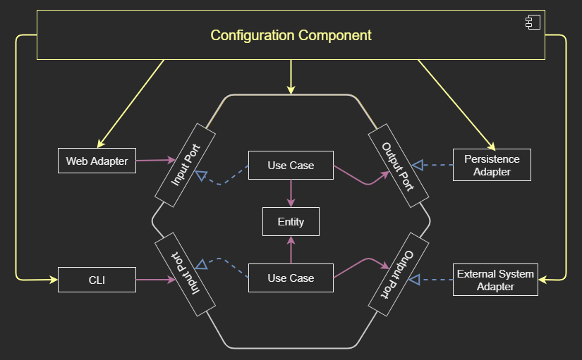

# Assembling the Application

## Why Even Care About Assembly?

### All dependencies should point Inwards
- towards the domain code of our application
- the domain code doesn’t have to change when something in the outer layers 
  changes
  
### The Use Case only knows an interface 
- and is provided an implementation of this interface at runtime
- the Use Case code is much easier to test

### Who’s responsible for creating the object instances of interfaces 
- in the same time, not violating the Dependency Rule

### There must be a configuration component that 
- is neutral to our architecture
- has a dependency to all classes to instantiate them 

|  |
| --- |

> 《Clean Architecture》 introduced in chapter 2 ___Inverting Dependencies___ 
> This configuration component would be in the outermost circle, which may 
> access all inner layers, as defined by the Dependency Rule 

### The Config Component is responsible for assembling a Working App 
- from the parts we provided

### The Configuration Component takes care of the wiring

### The Configuration Component has to know all the moving parts 
- to assemble them to a working application 

### The Configuration Component MUST
- #### Create Web Adapter instances 
- #### Ensure that HTTP requests are actually routed to the Web Adapters
- #### Create Use Case instances
- #### Provide Web Adapters with Use Case instances
- #### Create Persistence Adapter instances
- #### Provide Use Cases with Persistence Adapter instances
- #### Ensure that the persistence adapters can actually access the database 
- #### Be able to access configuration parameters
- #### Passes parameters on to the application components to control behavior
    - Datebase & EMail, for instance


## Assembling via Plain Code

- In Java, an application starts from the main method

### Within this main method, instantiate all the classes we need
- from web controller to persistence adapter, and wire them together 

### All Classes should be ``` public ```

### The Spring Framework is the most popular one in the Java World

### Spring provides web and database support, among a lot of other things


## Assembling via Spring’s Classpath Scanning

### The App Context contains all objects that together make up the App
- Beans in Java Lingo

### Goes through all classes that are available in the classpath 

### Searches for classes that are annotated with the ``` @Component ``` annotation
- creates an object from each of these classes
- the classes should have a constructor that take all required fields as an 
  argument
- Spring will find this constructor 
    - and search for @Component-annotated classes of the required argument types 
    - and instantiate them in a similar manner to add them to the application 
      context

### Can also create custom stereotype annotation for Spring to pick up
```
@Target({ElementType.TYPE})
@Retention(RetentionPolicy.RUNTIME)
@Documented
@Component
public @interface PersistenceAdapter {
    /**
     * The value may indicate a suggestion for a logical component name,
     * to be turned into a Spring bean in case of an autodetected component
     *
     * @return the suggested component name, if any (or empty String otherwise)
     */
    @AliasFor(annotation = Component.class)
    String value() default "";
}///:~
```

### Drawbacks

- #### When building a library or a framework for other developers to use 
    - Not to encumber our users with a dependency to the Spring framework 
      > encumber: to make it difficult for somebody to do something or for 
      > something  to happen

- #### Magic things might happen
    - the bad kind of magic causing inexplicable effects that might take days 
      to figure out if you’re not a Spring expert


## Assembling via Spring’s Java Config

### Overview 

#### 1. With the ``` PersistenceAdapterConfiguration ``` class in place
- Create a tightly-scoped config of persistence module instantiating all objects 
  we need in the Persistence Layer
- All objects for the Persistence Layer will be automatically picked up by 
  Spring’s classpath scanning 
- Still have Full Control about which beans actually added to the App Context

#### 2. Does not force us to sprinkle ``` @Component ``` annotations all over the codebase

#### 3. Keep the App Layer clean without any dependency to the Spring framework

### Spring’s Java Config is the Scalpel,
- while Classpath Scanning is the Cudgel of application assembly 

> scalpel /ˈskælpəl/ 手術刀 a small sharp knife used by doctors in medical operations
 
> cudgel noun/ˈkʌdʒl/ 大棒 a short thick stick that is used as a weapon

### This Spring Java Config Approach is similar to the plain code approach 
- but it’s less messy 
- provides us with a framework so that we don’t have to code everything by hand 

### Create Configuration Classes
- Each of these config classes is responsible for constructing a set of beans
  that are to be added to the application context

``` 
@Configuration
@EnableJpaRepositories
class PersistenceAdapterConfiguration {
    @Bean
    AccountPersistenceAdapter accountPersistenceAdapter(
            AccountRepository accountRepository,
            ActivityRepository activityRepository,
            AccountMapper accountMapper) {
        return new AccountPersistenceAdapter(
              accountRepository,
              activityRepository,
              accountMapper);
    }
    @Bean
    AccountMapper accountMapper(){
        return new AccountMapper();
    }
}
```

### The ``` @Configuration ``` annotation marks a Java class as a Config Class 
- to be picked up by Spring’s classpath scanning

### Using Classpath Scanning with Configuration Classes 
- only pick up configuration classes instead of every single bean
- reduces the chance of evil magic happening

### The repository objects are created by the ``` @EnableJpaRepositories ``` 

### Add ``` @EnableJpaRepositories ``` to the Custom Configuration
- other than the main application class

### Avoid activating JPA repositories every time the application starts up 

### Start up parts of the App instead of the whole thing

### Create configuration classes for Web Adapters

### Create configuration classes for certain modules within the App Layer

### When testing, create an App Context that contains certain modules
- but mocks the beans of other modules, giving great flexibility 

### Could push the code of each of those modules into its own codebase
- or, its own package, 
- or its own JAR file without much refactoring

### To restrict visibility 
- use Packages as Module Boundaries
- and create a dedicated config class within each package


## How Does This Help Me Build Maintainable Software

### When using Class Scanning, 
- Once the codebase grows, this quickly leads to lack of transparency
- Not know which beans exactly are loaded into the application context
- Also, cannot easily start up isolated parts of the App Context to use in tests

### Creating a dedicated Config Component 
- responsible for assembling the App
- rewarded with highly cohesive modules that we can start up in isolation from 
  each other 
- and that we can easily move around within our codebase

> dedicated: designed to do only one particular type of work; used for one 
> particular purpose only