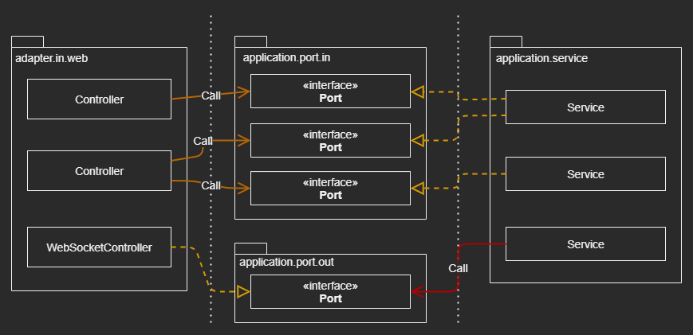

# Implementing a Web Adapter

> All communication with the outside world goes through adapters

## Dependency Inversion

|  |
| --- |


## Responsibilities of a Web Adapter

### What a Web Adapter usually does

1. Map HTTP request to Java objects
2. Perform authorization checks
3. Validate input (The input model to the Web Adapter)
4. Map input to the input model of the use case
5. Call the use case (the Port with the transformed Input Model 
6. Map output of the use case back to HTTP
7. Return HTTP response
8. The Web Adapter must translate the error into a message that is sent back to 
   the caller

### The Validation

- Do not implement the same validations in the web adapter as what done inthe 
  input model of the use cases
- Should validate that we can transform the Input Model of the Web Adapter into 
  the Input Model of the Use Cases
    - Anything that prevents us from doing this transformation is a validation 
      error

> Anything that has to do with HTTP must not leak into the application layer

> Start development with the Domain and Application Layers instead of with 
> the Web Layer


## Slicing Controllers

### Should rather build too many controllers than too few
- Should make sure that each ``` Controller ``` implements a slice of the 
  Web Adapter 
- Should make sure that each ``` Controller ``` is AS NARROW AS POSSIBLE and 
  that shares AS LITTLE AS POSSIBLE with other controllers

### Less code per class is a good thing

### Create a separate Controller for Each Operation 
- Potentially in a separate package  

### Should name the methods and classes as close to Use Cases as possible 

### Ech Controller can have its own Model
- Be private to the controller’s package

### Makes parallel work on different operations a breeze


## How Does This Help Me Build Maintainable Software?

- When building a web adapter to an application, we should keep in mind 
    - We’re building an Adapter that translates HTTP to method calls to Use Cases 
      of our application
    - Translates the results back to HTTP, and does not do any Domain logic 
    
- The application layer should not do HTTP
  
- We should make sure not to leak HTTP details
  - Makes the Web Adapter replaceable by another Adapter should the need arise 

- Easier to grasp, to test and support parallel work

- It’s more work initially to set up such fine-grained controllers, but it will 
  pay off during maintenance 