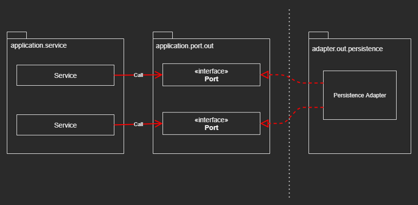
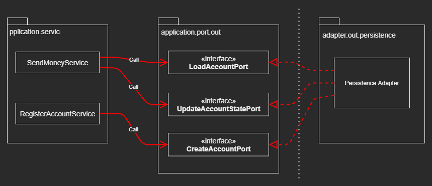
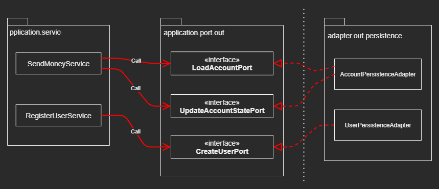
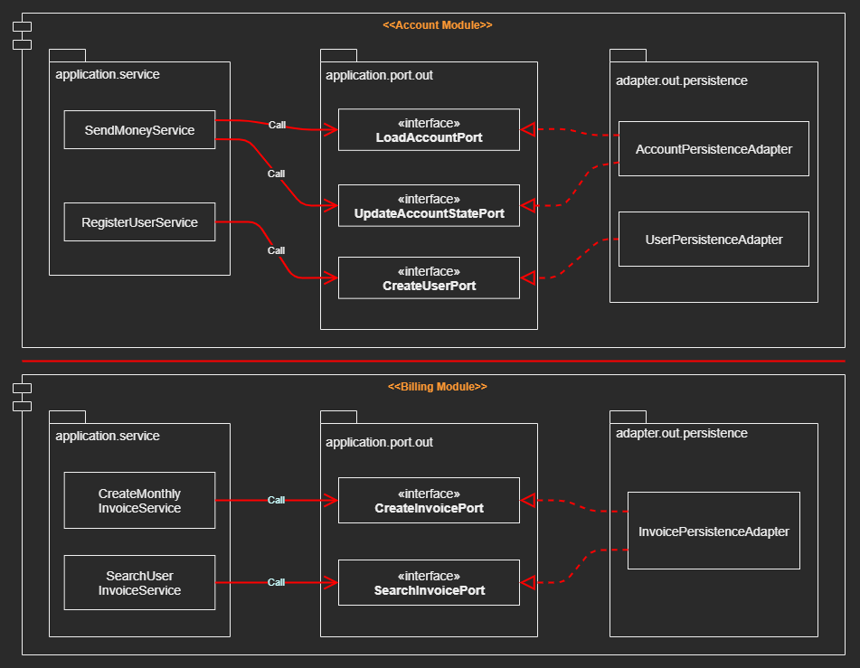

# Implementing a Persistence Adapter

## Overview

### Make the Persistence Layer a Plugin to the Application Layer


## Dependency Inversion

|  |
| --- |

### Application services call port interfaces to access persistence functionality

### The Persistence Adapter is a “Driven” or “Outgoing” Adapter

### The Ports are effectively a Layer of Indirection
- Between the App Services, and the Persistence Code

### Evolve the Domain Code without thinking about Persistence Problems

### A Refactoring in the Persistence code will not lead to changing the core


## Responsibilities of a Persistence Adapter

### What a Persistence Adapter usually does
1. Take input
2. Map input into database format
3. Send input to the database
4. Map database output into application format
5. Return output

### The Input Model to the Persistence Adapter lies within the application core
- not within the persistence adapter itself
- changes in the persistence adapter don’t affect the core

### The Output Model lies within the application core  
- not within the persistence adapter


## Slicing Port Interfaces

### Dependencies to methods that we don’t need in our context 
- Make the code harder to understand and to test

> Depending on something that carries baggage that you don’t need 
> can cause you troubles that you didn’t expect 
> [Clean Architecture by Robert C. Martin, page 86]

> [The Interface Segregation Principle] 
> Broad interfaces should be split into specific ones so that clients only know 
> the methods they need 

### The Slicing Solution
- Applying the [Interface Segregation Principle], and removes unnecessary 
  dependencies and makes the existing dependencies more visible 

|  |
| --- |

### The names of the ports clearly state what they’re about

### Most of the time there is only one method per port

### Having very narrow ports ___makes coding a PLUG AND PLAY experience___
- When working on a service, we just “plug in” the ports we need
- No baggage to carry around


## Slicing Persistence Adapters

### Implements one Persistence Adapter per Domain class 
- for which we need persistence operations
- Persistence Adapters are automatically sliced along the Seams Of The Domain 
- A good foundation for separating the persistence needs for multiple bounded 
  contexts 

|  |
| --- |

> Bounded Context: implies Boundaries, which means that 
> services of the account context may not access persistence adapters of the 
> billing context and vice versa 

> If one context needs something of the other, it can access it via a dedicated 
> incoming port, for example, the RESTful API

> If we want to create hard boundaries between bounded contexts, each bounded 
> context should have its own persistence adapter(s)

|  |
| --- |

### JPA Adapters for some ports, and JDBC Adapters for others
- Domain code doesn’t care about which class ultimately fulfills the contracts 
  defined by the persistence ports


## Example with Spring Data JPA

### @Entity-annotated classes are Required 
- Representing the database state of an ``` Account ```

> Spring Boot automatically finds repositories

> Spring Data will provide an implementation behind the repository interface

> ___JPA is a great tool, but for many problems, simpler solutions may be well & simpler___

### To load an account from the database
- Load the account from the ``` AccountRepository ``` 
- Load the activities of this account for a certain time window through the 
  ``` ActivityRepository ```

### To create a valid ``` Account ``` Domain Entity 
- Needs the balance the account had before the start of this activity window
    - so can get the sum of all withdrawals and deposits of this account from 
      the database

### Map all data to an Account-Domain-Entity and return it to the caller

### To Update the State of an ``` Account ``` 
- Iterate all activities of the Account entity 
- Check if they have IDs, if they don’t, they are new activities can be 
  persisted through the ```ActivityRepository```

### TWO_WAY Mapping 
- Between the ``` Account ``` and ``` AccountJpaEntity ``` 
- Between the ``` Activity ``` and ``` ActivityJpaEntity ``` 

### No Mapping Strategy

#### JPA forces us to make Compromises in the Domain Model

### Why Mapping Strategy
- To create a rich domain model without compromises to the underlying persistence


## Database Transactions

> A transaction should span all write operations to the database that are 
> performed within a certain use case so that all those operations can be 
> rolled back together if one of them fails.

### Delegate Transaction Responsibility to the services

### ASPECT_ORIENTED Programming (AspectJ) 
- to weave ___Transaction Boundaries___ into code


## Summary

### Building a Persistence Adapter that acts as a Plugin to the Domain 

### Create Rich Domain Model 

### Narrow Port Interfaces