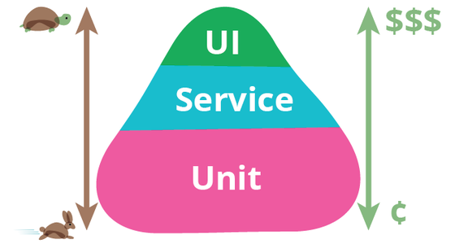
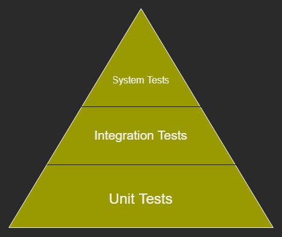

# Testing Architecture Elements

## Automated testing is a mystery


## The Test Pyramid

|  |
| --- |

|  |
| --- |

### We should have high coverage of Unit Tests 
- Unit Tests are cheap to build, easy to maintain, fast-running, and stable

### Tests tend to become more Expensive, Slower and more Brittle if: 
- Combine multiple units
- Cross unit boundaries
- Cross architectural boundaries
- Cross system boundaries

> The more expensive those tests become, the less we should aim for a high 
> coverage of these tests, otherwise, just spend too much time building tests 
> instead of new functionality 

> The definition of “unit test”, “integration test”, and “system test” varies 
> with context

### What is Unit Test? 
- A unit test usually instantiates a single class and tests its functionality 
  through its interface
- If the class under test has dependencies to other classes, those other classes 
  won't be instantiated, but replaced with mocks

### What is Integration Test?
- Instantiates a network of multiple units
- Verifies if this network works as expected by sending some data into it 
  through the interface of an entry class
- Crosses the boundary between two different layers, so the network of objects 
  is not complete or must work against mocks at some point 

### What is System Test?
- Spins up the whole network of objects that make up our application 
- Verify if a certain use case works as expected through all the layers of the 
  application 

### Above the System Tests 
- There might be a layer of end-to-end tests that include the UI of the 
  application


## Testing a Domain Entity ___with Unit Tests___


## Testing a Use Case ___with Unit Tests___

### Not to verify all interactions and focus on the most important ones


## Testing a Web Adapter ___with Integration Tests___

### Since the web controller is heavily bound to the Spring framework
- It makes sense to test it integrated into this framework instead of testing 
  it in isolation


## Testing a Persistence Adapter ___with Integration Tests___

### Verify the logic within the adapter, and the mapping into the DB

- With ``` @DataJpaTest ```, Spring instantiates the network of objects that 
  are needed for database access, including our Spring Data repositories that 
  connect to the database

- With ``` @Imports ```, to make sure that certain objects are added to that 
  network
  - Map incoming domain objects into database objects, for instance

- ``` @Sql("AccountPersistenceAdapterTest.sql") ```, put the database into a 
  certain state using an SQL script

### Not mocking away the database

### Persistence Adapter Tests should run against the real database

### Libraries like ``` Testcontainers ``` are a great help
- Spinning up a Docker container with a database on demand


## Testing Main Paths with System Tests

### @SpringBootTest(webEnvironment = WebEnvironment.RANDOM_PORT)
- Starting up the whole network of objects that makes up the application
- Configuring the application to expose itself on a random port

### Doing through the real HTTP

### Going through the real output adapters

### System Tests flush out other types of bugs 
- than the unit and integration tests do


## How Much Testing is Enough?

### Line coverage is a bad metric to measure test success
- Any goal other than 100% is completely meaningless
    - because important parts of the codebase might not be covered at all 
    - And even at 100%, we still can’t be sure that every bug has been squashed 

### Measuring test success in how confident we feel to ship the software

### The more often we ship, the more trust and confidence we have in our tests

### For each production bug, should ask: 
> Why didn’t our tests catch this bug? 
- Document the answer 
- Add a test that covers it

### A strategy that defines the tests we should create
- While implementing a domain entity, cover it with a Unit Test
- While implementing a use case, cover it with a Unit Test
- While implementing an adapter, cover it with an Integration Test
- Cover the most important paths a user can take through the application with 
  a System Test

### Tests lose their value if we have to modify them for each refactoring

### How Does This Help Me Build Maintainable Software?

