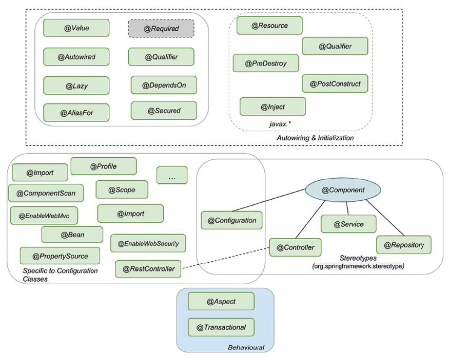
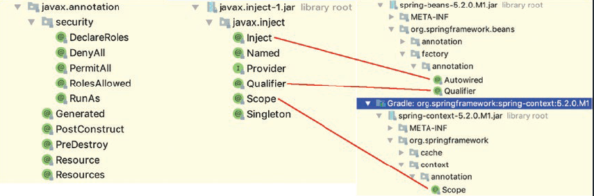
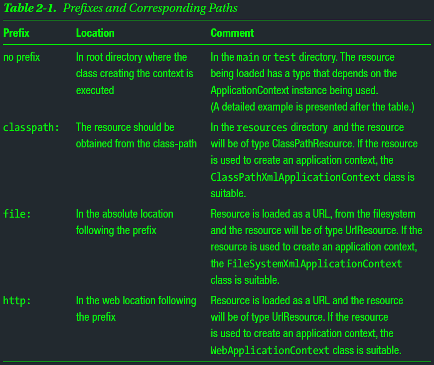
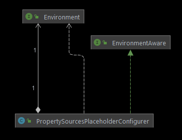

# Spring's IoC & DI

## Core Spring Modules for Spring IoC & DI
- ### spring-core
- ### spring-beans
- ### spring-context
- ### spring-context-support
- ### spring-expressions


## The Annotations

|  |
| --- |

- ### Stereotype Annotations
    - #### Mark classes According to their Purpose

        > Annotations denoting the roles of types or methods in the overall 
        > architecture (at a conceptual, rather than implementation, level) 
        
        > Stereotype, is for suggesting a role of particular class that is being 
        > annotated
        
        > In addition to the obvious component-scanning functionality, 
        > Spring suggests that they make nice point-cut demarcations for your 
        > AOP needs
        
        > denote something | denote that: to be a sign of something
         
        > Stereotype: something conforming to a fixed or general pattern; 
        > especially: a standardized mental picture that is held in common by 
        > members of a group and that represents an oversimplified opinion, 
        > prejudiced attitude, or uncritical judgment

    - #### ``` @Component ``` 
        - template for any Spring-managed component(bean)
    - #### ``` @Repository ``` 
        - template for a component used to provide data access, specialization 
          of the @Component annotation for the DAO layer
    - #### ``` @Service ``` 
        - template for a component that provides service execution, 
          specialization of the @Component annotation for the Service layer
    - #### ``` @Controller ``` 
        - template for a web component, specialization of the @Component 
          annotation for the web layer 
    - #### ``` @Configuration ```
        - configuration class containing bean definitions (methods annotated 
          with @Bean) 

- ### Autowiring and Initialization Annotations
    - Defines which dependency should be injected and what the bean looks like
    - #### ``` @Autowired ```
        - Core annotation for this group
        - Used on dependencies to instruct the Spring IoC to take care of 
          injecting them
        - Can be used on fields, constructors, setters and even methods 
          mentioned in the Injection Types section
        - Use with ``` @Qualifier ``` from Spring to specify name of the bean 
          to inject
    - #### ``` @Inject ```
        - From ``` javax.inject ``` package , equivalent annotation to 
          ``` @Autowired ```
        - Use with ``` @Qualifier ``` from ``` javax.inject ``` to specify name 
          of the bean to inject
    - #### ``` @Resource ```
        - From ``` javax.annotation ``` package
        - Equivalent annotation to ``` @Autowired ``` 
        - Provides a name attribute to specify name of the bean to inject
    - #### ``` @Required ```
        - Spring annotation that marks a dependency as mandatory
        - Deprecated since Spring 5.1
    - #### ``` @Lazy ```
        - Dependency will be injected the first time it is used
        - Avoid using it if possible
            - When starting a Spring App, ``` ApplicationContext ``` 
              implementations eagerly create and configure all singleton beans 
              as part of the initialization process
            - Useful for spotting configuration errors fast

- ### Annotations appearing only in (and on) Configuration classes
    - They are infrastructure specific
    - They define the configuration resources, the components, and their scope
    - #### ``` @Bean ```
    - #### ``` @Profile ```
    - #### ``` @Import ```
    - #### ``` @Scope ```
    - #### ``` @ComponentScan ```
    - #### ``` @PropertySource ```
    - etc. 

- ### Behavioral Annotations
    - Annotations that define behavior of a bean
    - #### ``` @Aspect ```
    - #### ``` @Transactional ```

- ### DI Annotations from JDK
    |  |
    | --- |


## Spring Config Classes & App Context

### Classes annotated with ``` @Configuration ```
- #### Contains bean declarations(@Bean)
- #### Tell how the beans can be found 
    - Configured by adding extra annotations (e.g., @Profile, @Scope) 
- #### Any Spring App has at its core one or more Configuration Classes
    - Contain bean declarations
    - Configured to tell where to look for bean declarations

### Provides the Config for an App
- #### Implements ``` ApplicationContext ``` which extends ``` BeanFactory ```
    - ``` BeanFactory ``` is the root interface accessing the Bean Container
- #### Implementations of ``` ApplicationContext ``` manage bean definitions
    - uniquely identified by their name

### An ``` ApplicationContext ``` implementation is able to
- #### Access beans using ``` BeanFactory ``` methods
- #### Load file resources using relative or absolute paths or URLs
- #### Publish events to registered listeners
- #### Resolve messages and support internationalization

### Spring IoC Container Creates & Initializes An App Context 
- #### Needs a configuration provided by
    - One or more XML file
    - A configuration class or more
    - both of above

### Spring IoC Container creates an App Context

### Spring IoC Container initializes an App Context with a Configuration
  - provided by a resource
      - an XML file (or more)
      - or, a configuration class (or more)
      - or both of above

### Provides a Resource as a String value
  - #### Spring Container loads the resource based on the prefix of the String value
  - #### Spring Container uses different classes to instantiate an App Context
      - based on the prefix of the provided String value
         

### How to Load a Resource
  - The App Context must implement interface 
    ``` org.springframework.core.io.ResourceLoader ```
    ``` 
    // No prefix
    Resource template = ctx.getResource("application-config.xml");
    ```

### The Loaded Resource Type dependes on the App Context Type
| App Context Type | Resource Type |
| ---------------- | ------------- |
| ClassPathXmlApplicationContext | ClassPathResource |
| FileSystemXmlApplicationContext | FileSystemResource |
| WebApplicationContext | ServletContextResource |
  - #### To force the resource type, no matter what context type used
      - the resource must be specified using the desired prefix

### How Spring IoC Container creates an App Context
  - #### Using an instance implementing ``` ApplicationContext ``` 
      - ``` org.springframework.context.annotation.AnnotationConfigApplicationContext ```
    
    ``` 
    @Configuration
    public class WebConfig {
    
    }///:~
    ```
    
    ``` 
    ApplicationContext appContext = 
            new AnnotationConfigApplicationContext(WebConfig.class);
    ```
  - #### ``` @Configuration ``` is a @Component annotation
      - The core annotation for creating beans
      - Means that the configuration class itself is a declaration for a bean
        ``` 
        07:01:54.582 [main] INFO  b.a.adapter.in.web.WebConfigTest - >>>>>>> Bean webConfig
        ```

### Declare Beans in a Configuration Class
  - #### Using ``` @Bean ``` annotation with a method
  - #### The annotated method has a return type of the class of the Bean
  - #### The annotated method name is the bean id
  - #### Every bean declared in a Spring application is a singleton by default
  - #### Spring IoC Container calls Bean methods when the App Context is initially created
  - #### Beans with dependencies, have two ways to be decalred
      - Using ``` @Autowired ``` 
      - Using ``` @Bean ``` in a configuration class 
      
### Scan Beans being not part of Configuration classes
  - Enable configuration class with bean scanning: add ``` @ComponentScan ```
      - [Not Recommended] No attribute, scan annotated classes in the current package and all sub-packages
      - With a various list of attributes for filtering and reducing scope of scanning
      
### Load Property Source
  - #### ``` @PropertySource ```
      - Adds a bean of type ``` PropertySource ``` to Spring's ``` Environment ```
      - Used to read property values from a property file set as argument
      - #### Also require a bean of ``` PropertySourcesPlaceholderConfigurer ```
          - ``` 
            public class PropertySourcesPlaceholderConfigurer
                    extends PlaceholderConfigurerSupport
                    implements EnvironmentAware
            ```
          - To replace the placeholders set as arguments for the ``` @Value ``` 
            annotated properties
          - Resolves ${...} placeholders within bean definition property values and
            ``` @Value ``` annotations against the current Spring Environment and
            its set of ``` PropertySources ```
          - It's bean method should be static
          - It's bean should be picked up eariler than adding property values in 
            the config class
  - #### ``` org.springframework.core.env.Environmwnt ```
      - ``` public interface Environment extends PropertyResolver ```
      - Spring Apps use it to provide a way to access the environment where the  
        current app is running
      - This bean models two key aspects of an application environment:
          - properties 
          - profiles 
      - Methods related to property access are exposed via the 
        ``` PropertyResolver ``` super interface
      - The role of the ``` Environment ``` bean is to provide a convenient way 
        to declare property sources and inject property values from them where 
        required
      - In most cases, however, app-level beans should not need to interact with 
        the ``` Environment ``` directly 
        - but instead may have to have ``` ${...} ``` property values replaced 
          by a property placeholder configurer such as 
          ``` PropertySourcesPlaceholderConfigurer ```, which itself is 
          ``` EnvironmentAware ``` and as of Spring 3.1 is registered by default 
          when using <context:property-placeholder/>
      - ``` EnvironmentAware ``` is an interface to be implemented by any bean 
        that wishes to be notified of the Environment that it runs in
        ``` 
        void setEnvironment(Environment environment)
        ```
        |  |
        | --- |

  ``` 
    @Slf4j
    @Configuration
    @RequiredArgsConstructor
    @PropertySource("classpath:db/datasource.properties")
    public class DataSourceConfig {
    
        @Value("${spring.datasource.url}")
        private String url;
    
        @Value("${spring.datasource.driverClassName}")
        private String driverClassName;
    
        @Value("${spring.datasource.username}")
        private String username;
    
        @Value("${spring.datasource.password}")
        private String password;
    
        private final Environment environment;
    
        @Bean
        public static PropertySourcesPlaceholderConfigurer
        propertySourcesPlaceholderConfigurer() {
            return new PropertySourcesPlaceholderConfigurer();
        }
    
        @Bean
        DataSource dataSource() throws SQLException {
    
            DriverManagerDataSource driverManagerDataSource =
                    new DriverManagerDataSource();
    
            driverManagerDataSource.setDriverClassName(this.driverClassName);
            driverManagerDataSource.setUrl(this.url);
            driverManagerDataSource.setUsername(this.username);
            driverManagerDataSource.setPassword(this.password);
    
            log.info(">>>>>> Access pw with Environment: {}",
                    this.environment.getProperty("spring.datasource.password"));
    
            return driverManagerDataSource;
        }
    
    }///:~
   ```


## Injection Types

### Overview 

#### Spring supports three types of Dependency Injection
  - Constructor Injection
  - Setter Injection
  - Field Injection

### ``` @Autowired ``` Annotation declares Dependencies in Spring
- Automatic Dependency Injection
- Used on fields, constructors, setters, and even methods
- Indicates that Spring should take care of injecting that dependency
- Enabled only in Spring App using component scanning and stereotype annotations 
  to create beans

### How does Spring Know What to Inject?
- Every bean in the application context has a Unique Identifier
- It is the developer’s responsibility to name beans accordingly if needed
- To declare beans when using Annotations, must annotate classes with 
  stereotype annotations: 
    - ``` @Componentand ``` 
    - ``` @Service ```
    - ``` @Repository ``` 
    - ``` @Controller ```
- Spring IoC container down-cases the first letter of the class names and sets 
  them as the bean names
- To rename the bean, give the name to the @Component annotation (or any of the 
  stereotype annotations) as argument