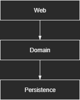
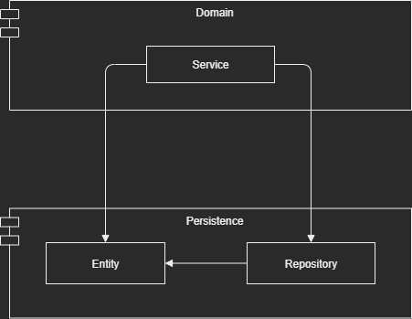
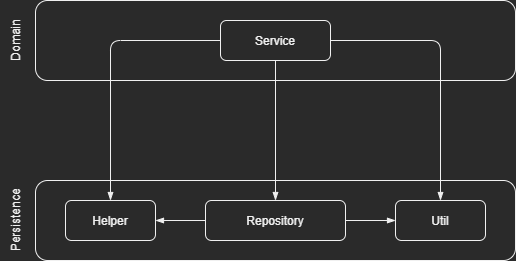
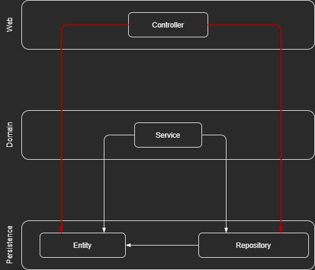

`# What's Wrong with Layers
--------------------------------------------------------------------------------

|  |
| --- |

## How Layers Work Together?

- The web layer that receives requests and routes them to a service in the 
  domain or “business” layer
  
- The service does some business magic and calls components from the persistence 
  layer to query for or modify the current state of our domain entities

## The Desired Result of Layers

- To build domain logic that is independent of the web and persistence layers

- The web or persistence technologies can be switched without affecting the 
  domain logic 

- Add new features without affecting existing features

- ___Keep options open___ and are ___able to quickly adapt to___ changing 
  requirements and external factors

> **keep/leave your options open**: to avoid making a decision now so that you 
> still have a choice in the future

## The Truth

> A Layered-Architecture has ***Too Many Open Flanks*** that allow bad habits to 
> creep in and make the software ***Increasingly Harder to Change Over Time***

## Layered-Architecture Promotes Database-Driven Design

1. ***WHAT*** we’re trying ***TO ACHIEVE*** with almost any application we’re 
   building
     - ***CREATE a MODEL of the RULES or “POLICIES”*** that ***GOVERN the BUSINESS*** 
       in order to make it easier for the users to interact with them
     - ***MODEL BEHAVIOR***, and ***NOT STATE*** 
         - Even state is an important part of any application
         - ***THE BEHAVIOR IS WHAT CHANGES THE STATE***
         - ***THE BEHAVIOR DRIVES THE BUSINESS*** 

2. The foundation of a conventional layered architecture is the database
  - The web layer depends on the domain layer which in turn depends on the 
    persistence layer and thus the database
  - Everything builds on top of the persistence layer

3. Why are we making the database the foundation of our architecture and not the 
   domain logic?
  - We are with the natural flow of dependencies of a conventional layered 
    architecture
  - It makes absolutely no sense from a business point of view

4. We should ***BUILD THE DOMAIN LOGIC BEFORE DOING ANYTHING ELSE***
  - Only then can we find out if we have understood it correctly 
  - Only once we know we’re ***BUILDING THE RIGHT DOMAIN LOGIC***, should we 
    move on to build a persistence and web layer around it

> **Only once ..., should ...** : 只有一旦 ... 才能 ... 

5. The use of Object-Relational Mapping (ORM) with a layered architecture makes
   us easily be tempted to _**mix business rules with persistence aspects**_ 

> Don’t get me wrong (不要誤會我), I love ORM, and I’m working with JPA and 
> Hibernate on a daily basis

|  |
| --- |

  - The Domain layer is allowed to access those entities in Persistence Layer 

  - If it’s allowed to use them, they will be used and this creates a strong 
    coupling between the Persistence Layer, and the Domain Layer

  - The reality is, the services _**use the persistence model as their business 
    model**_ and **_not only_** have to **_deal with the domain logic_**, but 
    also with persistence tasks like
      - eager vs. lazy loading,
      - database transactions
    - flushing caches
    - similar housekeeping

  - The persistence code is virtually fused into the domain code and thus it’s 
    hard to change one without the other
      - That’s the opposite of being _**flexible**_ and _**keeping options open**_, 
        which should be the goal of our architecture

## It's Prone ot Shortcut

1. What is a Shortcut? (Or, Shortcut for What?)
     - The global rule of conventional layered architecture 
     - If we need access to a certain component in a layer above ours, we can 
       just push the component down a layer, and we’re allowed to access it, 
       and problem Solved
        - conventional: following what is traditional, or the way something has been
          done for a long time
        - The Role: From a certain layer, we can only access components in the same
          layer, or a layer below.

2. Why the Shortcut is bad?
     - Doing the Shortcut once may be OK, however, doing it once opens the door 
       for doing it a second time
     - If someone else was allowed to do it, so am I?
     - If there is an option to do something, someone will do it, especially in 
       combination with a looming deadline
     - if something has been done before, the threshold for someone to do it 
       again will lower drastically
       > It's the “Broken Windows Theory”
     - Over years of development and maintenance of a software project, the 
       persistence layer may very well end up like this: 

        |  |
        | --- |

3. The persistence layer (the bottom-most layer) will grow fat as we push 
   components down through the layers
     - Perfect candidates for this are helper or utility components

4. If we want to disable the “shortcut mode” for our architecture, layers are 
   not the best option
      - At least not without enforcing some kind of additional architecture rules 
      - “Enforce” does not mean doing code reviews but rules that make the build 
        fail when they’re broken

## It Grows Hard to Test (Another Shortcut)

|  |
| --- |

1. Layers are being Skipped
     - For example, accessing persistence layer from web layer

2. This feels OK the first couple of times, but it has _**Two Drawbacks**_ if it 
   often happens, and it will, once someone has done the first step 
     - **First**, we’re implementing domain logic in the web layer, even if it’s 
       only doing very simple persistence process
     - If the use case expands in the future, ***more domain logic will be added 
       to the web layer*** 
         - _**Mixing responsibilities**_
         - _**Spreading essential domain logic all over the application**_ 
     - **Second**, in the tests of our web layer, we not only have to mock away 
       the domain layer, but also the persistence layer
     - This adds complexity to the unit test
     - A complex test setup is the first step towards _**no tests**_ at all, 
       because we _**have no time**_ for them

3. As the web component grows over time, it may accumulate a lot of dependencies 
   to different persistence components,  
     - Adding to the test’s complexity
     - Taking more time for us to understand and mock away the dependencies 
       than to actually write test code 

## Layered Architecture Hides the Use Cases

### Very hard to find the right spot to add new functionalities  

### We devs spending much more time changing existing code than creating new 

### The good architecture should help us to quickly navigate the codebase 

### Layered architecture
- Scatters the domain logic throughout the layers
- Has many ___broad services___, and each of them serves multiple use cases 
    - Many dependencies to the persistence layer
    - Many components in the web layer depend on them

### A highly-specialized narrow domain service only serve a single use case 

## Layered Architecture Makes Parallel Work Difficult

### Layered Architecture makes Parallel-Working very difficult
- Everything builds on top of the persistence layer 
- The persistence layer must be developed first 
- Then comes the domain layer 
- Finally, the web layer 
- ___Only one developer can work on the feature at the same time___ 

### DDD makes working against interfaces possible

### ___Broad Services___ make Parallel-Working much more difficult