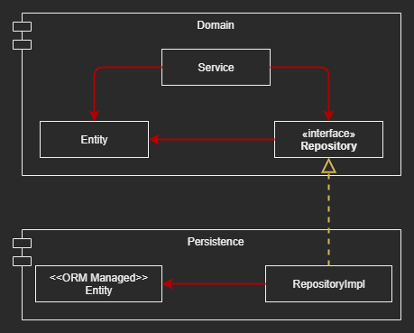
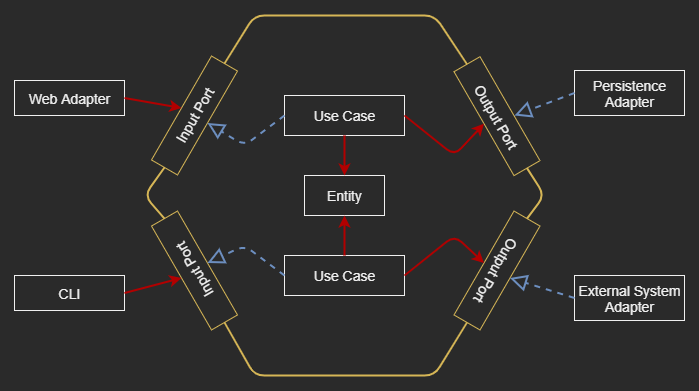

# Inverting Dependencies - The Overview of Hexagonal Architecture

## The Single Responsibility Principle - SRP

### A component should have only one reason to change

### A Single Reason to Change Principle - SR2CP
  - Change one component won't affect others

### More dependencies, more easy to break SRP or SR2CP
  - Over time, components collect more and more reasons to change
  - After that, changing one component might cause another component to fail
  - Changing in one area of the codebase often has side effects in other areas

## The Dependency Inversion Principle - DIP

> We can turn around (invert) the direction of any dependency within our codebase 

### Make the persistence code depends on the domain code

|  |
| --- |

## Clean Architecture

> The business rules should be testable by design and independent of frameworks, 
> databases, UI technologies and other external applications or interfaces

> The domain code must not have any outward facing dependencies

> With the help of the DIP, all dependencies point toward the domain code

### The cost of Clean Architecture

- The domain layer is completely decoupled from the outer layers like 
  persistence and UI 
- We have to maintain a model of our application’s entities in each of the layers 

## Hexagonal Architecture

|  |
| --- |

### About the Name
- The term “Hexagonal Architecture” stems from Alistair Cockburn
- Also called a “___Ports___ and ___Adapters___” architecture

### About the Shape
- The hexagon shape means having more than 4 sides connecting to other systems 
  or adapters

### Adapters
- Externals interact with the application with Adapters
    - ___Driving-Adapters___: The Left-Adapters ___drive___ the App
    - ___Driven-Adapters___: The Right-Adapters ___are driven by___ the App
- The adapters translate between the application and other systems

### Ports
- The App's core provides specific ports for driving adapters
    - For ___Driving-Adapters___, an interface implemented the use case in the 
      core and called by the adapter
    - For ___Driven-Adapters___, an interface that is implemented by the adapter 
    and called by the core

## Summary

- By inverting the dependencies
    - The domain code has no dependencies to the outside 
    - The domain logic is decoupled from all Persistence and UI specific problems 
    - Reduce the number of reasons to change throughout the codebase
    - Fewer reasons to change means better maintainability

- The domain code is free to be modelled as best fits the business problems 

- The persistence and UI code are free to be modelled as best fits the 
  persistence and UI problems 