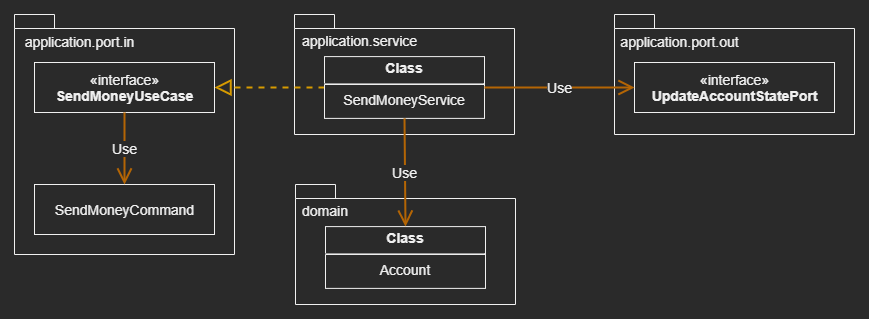

# Implementing a Use Case

## Overview

### Implement Use Cases in an Opinionated Way within the Hexagonal Architecture Style


## Implementing the Domain Model

### The Use Case: Sending Money from one Account to Another

### The Entity: An Account that allows us to Withdraw and Deposit Money


## A Use Case in a Nutshell

### What a Use Case actually Does

1. Take input (No Validation)
     - Validate input else where

2. Validate business rules
    - The Use Case is responsible for validating Business Rules

3. Manipulate model state
     - Also pass the new state to a port implemented by the persistence adapter

4. Return output
     - Translate the return value From the Outgoing Adapter into an output
       object which will be returned To the Calling Adapter

### A Use Case takes Input from an Incoming Adapter

### Create ___A Separate Service Class___ for Each Use Case 

|  |
| --- |


## Validating Input

> With Validation located in the Input Model, Use Case Implementations are 
> surrounded by an anti-corruption layer

### Let the input model take care of Validating the Input
  - ``` buckpal.account.application.port.in.SendMoneyCommand ```
  - Should be an Immutable Model
  - This builds a thin, protective screen around our use cases that bounces bad 
    input back to the caller

### The de-facto Standard: the Bean Validation API²⁰
  - Allows us to express the validation rules as Annotations on the fields of a 
    class
  
  ``` 
    @Value
    @EqualsAndHashCode(callSuper = false)
    public class SendMoneyCommand extends SelfValidating<SendMoneyCommand> {
    
        @NotNull
        private final Account.AccountId sourceAccountId;
    
        @NotNull
        private final Account.AccountId targetAccountId;
    
        @NotNull
        private final Money money;
    
        public SendMoneyCommand(Account.AccountId sourceAccountId,
                                Account.AccountId targetAccountId,
                                Money money) {
    
            this.sourceAccountId = sourceAccountId;
            this.targetAccountId = targetAccountId;
            this.money = money;
    
            this.validateSelf();
        }
    } 
  ```


## The Power of Constructors

### Using Constructor or Builder ???


## Different Input Models for Different Use Cases

> Allowing `` null ``` as a valid state of a field in an immutable command 
> object is a code smell by itself 

> A dedicated input model for each use case 
>   - Makes the Use Case much clearer 
>   - Decouples it from other use cases, then Preventing unwanted side effects

> See mapping strategy along with other mapping strategies in 
> "Mapping Between Boundaries" Part


## Validating Business Rules

### Validating business rules is part of the Use Case logic 

### Business Rules are the core of the application

- Validating a Business Rule requires access to the current state of the domain model
    - Semantical Validation
    - Example: the source account must not be overdrawn

- Validating Input does not require access to  the current state of the domain model
    - Syntactical Validation
    - Example: the transfer amount must be greater than zero

### How to implement a Business Rule?

#### Put the Business Rules into a Domain Entity

``` 
@AllArgsConstructor(access = AccessLevel.PRIVATE)
public class Account {
    public boolean withdraw(Money money, AccountId targetAccountId) {
        if (!mayWithdraw(money)) {
            return false;
        }
        ... ...
    }
    ... ...
}
```

#### Put it in the Use Case Code before it starts working on the Domain Entities
``` 
package buckpal.application.service;

@RequiredArgsConstructor
@Transactional
public class SendMoneyService implements SendMoneyUseCase {
    ... ...
    @Override
    public boolean sendMoney(SendMoneyCommand command) {
        requireAccountExists(command.getSourceAccountId());
        requireAccountExists(command.getTargetAccountId());
        ...
    }
    ... ...
}
```


## Rich vs. Anemic Domain Model

> Anemic: weak and not having much effect


## Different Output Models for Different Use Cases

- Once the use case has done its work, what should it return to the caller?
    - the minimal and most specific value, the Output Model

> Try to keep our use cases as specific as possible and return as little as 
> possible

> The Output Model should only include the data that is really needed for the 
> caller to work

> Shared Output Models tend to grow tumorously (腫瘤似的) for multiple reasons 
> in the long run 

> Apply the Single Responsibility Principle and keeping Output Models separated 
> helps decoupling use cases 

> Sharing the same Output Model between use cases tends to tightly couple those 
> use cases

> Resist the temptation to use Domain Entities as Output Model 

> We don’t want Domain Entities to change for more reasons than necessary


## What About Read-Only Use Cases?

> Create a dedicated incoming port for the query and implement it in a 
> Query Service 

``` 
@RequiredArgsConstructor
class GetAccountBalanceService implements GetAccountBalanceQuery {

	private final LoadAccountPort loadAccountPort;

	@Override
	public Money getAccountBalance(AccountId accountId) {
		return loadAccountPort.loadAccount(accountId, LocalDateTime.now())
				.calculateBalance();
	}
}
```

> Query Service doesn’t really do any work other than passing the query on to 
> the outgoing port 


## How Does This Help Me Build Maintainable Software

### Model the Input and Output of Use Cases Independently
-  to Avoid ___Unwanted Side Effects___

### Introduce a separate model for each use case

### Map between Input / Output Models to Entities

### Allow for a crisp understanding of a use case 

### Make it easier to maintain in the long run
  
### Allow multiple developers to work on different use cases in arallel 
- without stepping on each other’s toes

### Together with a tight input validation
- Going a long way toward a maintainable codebase