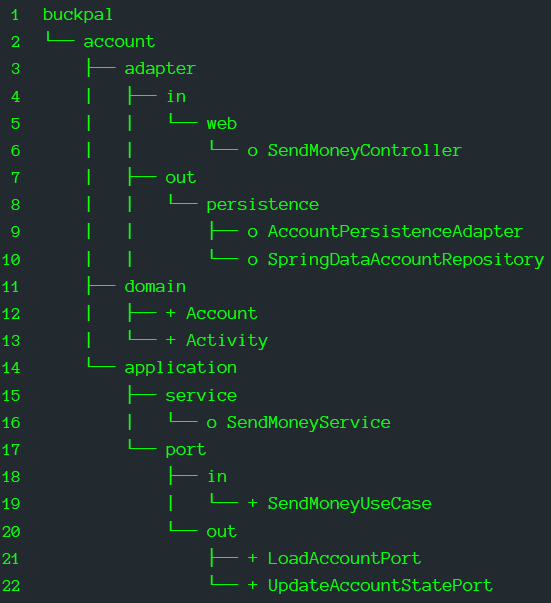

# Enforcing Architecture Boundaries

## Overview

### Architecture tends to Erode over time
- Boundaries between layers weaken
- Code becomes harder to test
- Generally need more and more time to implement new features

### Enforce the Boundaries within the Architecture
- #### to fight architecture erosion


> erode: v. /ɪˈrəʊd/ to gradually destroy the surface of something through the 
> action of wind, rain, etc.; to be gradually destroyed in this way

> erosion n. /ɪˈrəʊʒn/ the process by which the surface of something gradually 
> destroyed through the action of wind, rain, etc.


## Boundaries and Dependencies

|  |
| --- |
> Enforcing that dependencies point in the right direction
> Red-Dashed Arrows mark dependencies that are not allowed according to the 
> architecture 

### The innermost layer contains Domain Entities

### The App Layer may access those Domain Entities 
- to implement use case within Application Services

### Driving Adapters access Services through Incoming Ports

### Services may access Driven Adapters through Output Ports

### The Config Layer contains Factories creating Adapters and Services
- to provide them to a Dependency-Injection mechanism

### There is a Boundary between each layer and its next Inward neighbor

### There is a Boundary between each layer and its next Outward neighbor

### Dependencies crossing Layer Boundary must ALWAYS POINT INWARDS

### Make sure that there are no illegal dependencies 
- that point in the wrong direction


## Visibility Modifiers

| 
| --- |

### The package-private modifier uses Java packages to group classes 
- into cohesive modules
- Classes within such a module, can access each other, 
- Classes within such a module, cannot be accessed from outside the package

### Make the classes in the persistence package package-private
- marked with "o" 

### Make the classes in the service package package-private
- marked with "o"

### Dependency Injection mechanisms use reflection to instantiate classes 
- so they will still be able to instantiate those classes even if they’re 
  package-private

### With Spring, this package-private approach only works 
- if we use the ___Classpath Scanning___ approach

### Other approaches require us to create instances of those objects ourselves
- which requires ___public access___

### The rest of the classes have to be public (marked with “+”)
- the ___domain package___ needs to be accessible by the other layers
- the ___Port Interfaces___ in application layer needs to be accessible 
    - by the web and persistence adapters

### The package-private modifier is awesome for small modules 
- with no more than a couple handful of classes

### It ___grows confusing___ to have so ___many classes in the same package___
- once a package reaches a certain number of classes 

### A ~~failed solution~~ for the big private package
- Create sub-packages, but this is where the package-private modifier fails to 
  deliver
    - Java treats sub-packages as different packages 
    - The parent package cannot access a package-private member of its sub-package
- so, members in sub-packages must be public, exposing them to the outside world 
- making the architecture vulnerable to illegal dependencies


## Post-Compile Checks

### ArchUnit provides an API 
- #### checks if dependencies point in the expected direction
- #### If it finds a violation, it will throw an exception

### Resources
- #### [Introduction to ArchUnit](https://www.baeldung.com/java-archunit-intro)
- #### [ArchUnit User Guide](https://www.archunit.org/userguide/html/000_Index.html)
- #### [ArchUnit API](https://javadoc.io/doc/com.tngtech.archunit/archunit/latest/index.html)
- #### [ArchUnit Maven plugin](https://github.com/societe-generale/arch-unit-maven-plugin)
- #### [ArchUnit-Examples](https://github.com/TNG/ArchUnit-Examples)

### To include ArchUnit’s JUnit 5 support
- simply add the following dependency

``` 
<dependency>
    <groupId>com.tngtech.archunit</groupId>
    <artifactId>archunit-junit5</artifactId>
    <version>0.19.0</version>
    <scope>test</scope>
</dependency>
```
